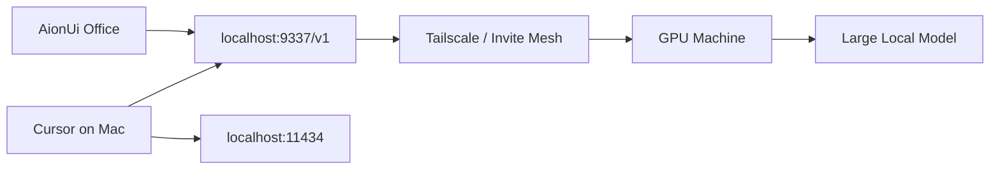

# Multi-Machine Models

Use Ollama for single-machine models and Mesh-LLM for large local models shared across Cursor machines.

## Endpoints

- Ollama: `http://localhost:11434`
- Mesh-LLM: `http://localhost:9337/v1`

Mesh-LLM is OpenAI-compatible, so tools that support an OpenAI base URL can point at `http://localhost:9337/v1`.

## Topology



## Commands

Inspect this machine:

```bash
mesh-llm gpus
mesh-llm models installed
```

Start a model on a GPU host:

```bash
mesh-llm serve --model <model-name>
```

Join from a Cursor-only machine:

```bash
mesh-llm --client --join <invite-token>
```

Stop local mesh processes:

```bash
mesh-llm stop
```

## Policy

- Keep client code and proprietary prompts on private meshes only.
- Prefer Tailscale-reachable machines and invite tokens.
- Do not use public mesh discovery for confidential client work.
- Keep Ollama as the fallback when Mesh-LLM is offline.
